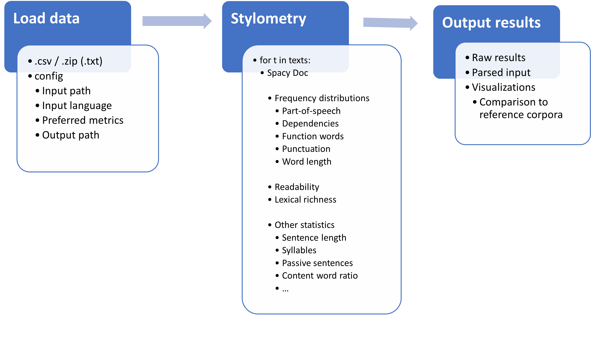

## Documentation

This repository contains the code to the CLARIAH-VL stylometry analysis pipeline.

### Installation
1. Create a new conda environment using ```conda create -n {name here} python=3.9.18```
2. Activate the environment with ```conda activate {env_name}```
3. Clone the respository: ```git clone https://github.com/LemmensJens/CLARIAH-stylo.git```
4. In this repo's home directory, install requirements with ```pip3 install -r requirements.txt```

### Quick start
1. Set up the config file.
2. Run ```python stylo.py```

### Demo
For an online demo, please visit https://stylene.uantwerpen.be/.
For a local demo of the pipeline, run ```python get_demo_data.py```, initialize the config file with ```python create_config.py```, and run ```python stylo.py```. The demo data consists of the test partition of the DBRD (Dutch Book Review Dataset).

### Pipeline overview



#### Set up the config file
In ```create_config.py```, set the input and output parameters:

1. ```input```: Full path to the input data

2. ```input_format```: Format of the input data. Can be either 'csv' for .csv files, or 'zip' for folders that contain .txt files (one per text).

3. ```text_column```: Only relevant if 'input_format' is 'csv'. Refers to the name of the column that contains the text data, default is 'text'.

4. ```delimiter```: Only relevant if 'input_format' is 'csv'. Refers to the column delimiter, default is ','.

5. ```language```: language of the input data. Default is 'Dutch', other valid options are 'English', 'French', 'German'

6. ```readability metric```: Refers to the metric used to compute readability. Default is 'RIX', other valid options are 'ARI', 'ColemanLiau', 'Flesch', 'FOG', 'Kincaid', 'LIX', 'SMOG'.

7. ```lexical diversity metric```: Refers to the metric used to compute lexical diversity. Default is "STTR", other valid options are 'TTR', 'RTTR', 'CTTR', 'Herdan', 'Summer', 'Dugast', 'Maas'.

8. ```output_dir```: folder in which the output of the pipeline is stored

9. ```overwrite_output_dir```: Boolean that decides whether the overwrite the contents of "output_dir" if this folder already exists

#### Run the pipeline
To run the pipeline, simply use the following command: ```python stylo.py```

#### Output
1. ```dependency_profile.csv```: Relative frequencies of dependencies per text.

2. ```function_word_distribution.csv```: Relative frequencies of function words per text.

3. ```length_statistics.csv```: Various statistics regarding the length of the text and words.

4. ```lexical_richness_statistics.csv```: Lexical richness score per text (cf. metric specified in the config file).

5. ```parsing_results.csv```: Parsed texts (part-of-speech tags and syntactic dependencies).

6. ```pos_profile.csv```: Relative frequencies of the part-of-speech tags used per text.

7. ```punctuation_distribution.csv```: Relative frequencies of the punctuation marks used per text.

8. ```readability_statistics.csv```: Readability score per text (cf. metric specified in the config file).

9. ```word_length_distribution.csv```: Relative distribution of word lengths per text (in number of characters).

10. ```visualizations```: Plotly visualizations of the distributions described above.
